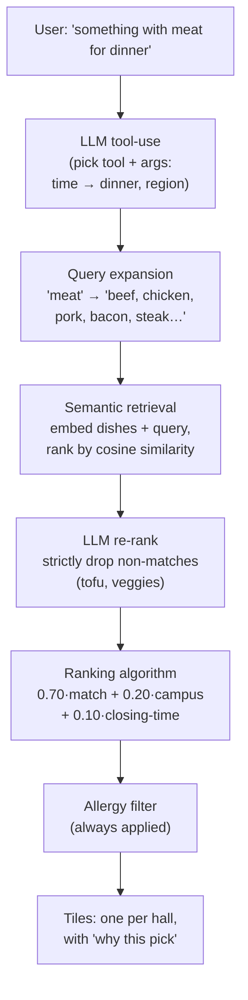

# 🍽️ CU Dining+

An AI assistant that tells you **what to eat on campus right now** — ask in plain
English ("something with meat for dinner", "healthy lunch", "where's pizza?") and it
searches **live** Cornell Dining menus, then fills the screen with the best dining halls
and their dishes.

It's built around one idea: **let the model reason over live data, instead of doing
keyword search.** You tell it once where you eat each meal; after that it figures out the
meal from the time of day, recommends on the right campus, and never shows you anything
you're allergic to.

---

## What it does

- **Understands cravings, not keywords.** "meat" finds Beef Stroganoff, Korean BBQ
  Chicken and Pulled Pork — not just dishes with the letters *m-e-a-t*.
- **Knows the time = the meal.** Ask "for dinner" and it searches dinner menus on your
  dinner campus. Ask at 8am and it assumes breakfast.
- **Remembers you across sessions.** Your campuses, dietary needs and allergies are saved
  to disk; allergens are always filtered out.
- **Two front-ends:** a terminal chat (`chat.py`) and a web app (`server.py`) with a
  button-based setup and a tile board you can click into for full menus.

---

## How the AI works (the interesting part)

A vague word like "meat" embeds too weakly to separate meat from tofu, so the assistant
runs a small **retrieval + re-ranking pipeline** rather than a single search:



**Techniques used:** OpenAI function-calling (tool use), text embeddings + cosine
similarity (semantic search), query expansion and LLM re-ranking (both standard
retrieval-augmented-generation techniques), and a transparent weighted ranking algorithm.

---

## Project layout

| File | Role |
|------|------|
| `dining.py` | Data layer — live Cornell Dining API, timezone-correct meal/hours logic, menu lookup |
| `semantic.py` | Embeddings, cosine similarity, query expansion, LLM re-ranking (all cached) |
| `recommend.py` | The ranking pipeline that blends semantic match + campus + closing-time |
| `preferences.py` | Persistent user profile (campuses per meal, dietary, allergies) |
| `chat.py` | Terminal chatbot: system prompt + tools + function-calling loop |
| `server.py` | Flask web app: onboarding, tile board, full-menu modal |
| `templates/index.html` | The web UI (vanilla JS, no build step) |

---

## Setup

```bash
cd dining_ai
python3 -m venv .venv
.venv/bin/pip install -r requirements.txt
echo "OPENAI_API_KEY=sk-..." > .env
```

## Run it

**Web app** (recommended — has onboarding + tiles):

```bash
.venv/bin/python server.py
```

Then open <http://127.0.0.1:5001>.

**Terminal chat:**

```bash
.venv/bin/python chat.py
```

---

## Notes & limitations

- Campus areas are **North, West, Central** (Cornell has no dining "East" campus).
- Menus come live from Cornell's public Dining API and are cached for 15 minutes.
- The query-expansion and re-rank steps add a second or two per search — the trade for
  accurate, on-topic results.
- Nicknames are handled (e.g. "Appel" → North Star Dining Room).
